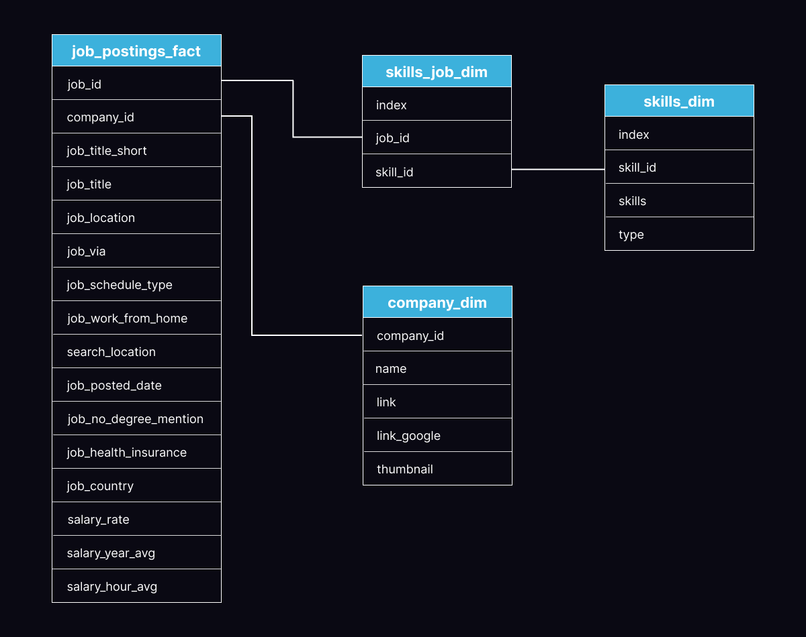

# SQL Load Setup

This folder contains the scripts used to set up the PostgreSQL database that powers the rest of the analysis in this project.

While the core of this project focuses on querying and visualizing job data, this setup process is included for full transparency and reproducibility. If you're looking to explore or extend the data yourself, this folder provides everything needed to recreate the schema and load the data.

> ⚠️ **Note**: The dataset and original schema design were provided by Luke Barousse as part of a public SQL course. I have made modifications and built this project independently as a standalone portfolio piece.

---

## 📂 Folder Contents

### [1_create_database.sql](1_create_database.sql)
Creates the PostgreSQL database.

```sql
CREATE DATABASE data_jobs_db;
-- DROP DATABASE IF EXISTS data_jobs_db;  -- (Optional reset)
```

---

### [2_create_tables.sql](2_create_tables.sql)
Creates the core tables:
- `company_dim`
- `skills_dim`
- `job_postings_fact`
- `skills_job_dim`

Includes:
- Primary and foreign key constraints
- Indexes for performance
- Ownership statements for PostgreSQL setup

---

### [3_load_data.sql](3_load_data.sql)
Used to load CSV data into the database using `COPY` statements.

> ⚠️ **Important**: These file paths are placeholders.
If you plan to reuse these scripts, you’ll need to replace:
```
'path/to/your/file.csv'
```
with the actual path to the dataset on your own machine.

Example:
```sql
COPY company_dim
FROM '/your/local/path/company_dim.csv'
WITH (FORMAT csv, HEADER true, DELIMITER ',', ENCODING 'UTF8');
```

---

## 🗺️ Schema Overview
The database consists of four main tables structured in a typical star schema format:



- `job_postings_fact`: Core fact table containing one row per job posting
- `company_dim`: Company-level information
- `skills_dim`: List of skills and their types
- `skills_job_dim`: Bridge table linking skills to job postings

This schema enables flexible querying across dimensions like company, skill, and job title.

---

## 🚧 Additional Notes

- The `skills_job_dim` table uses a composite primary key `(job_id, skill_id)`.
- The schema was lightly adapted from its original form to better support Tableau filtering and performance.
- If you'd like to recreate the project from scratch, run the scripts in order:
  1. `1_create_database.sql`
  2. `2_create_tables.sql`
  3. `3_load_data.sql`

---

For more information, check out the main project [README](../README.md).

