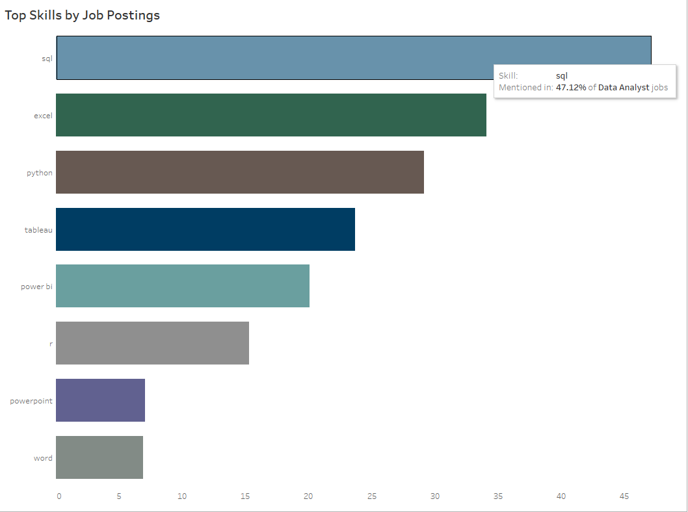

//TEMP

//NOTE Formatting is equivalent to obsidian
# Introduction
// ADD Introduction / summary of the project
# Background
//
# Tools I Used
//

### 📌 Skill Demand by Job Title

**Question:**  
What are the most in-demand skills for each job title based on the percentage of job postings mentioning them?

**Purpose:**  
This query calculates the percentage of postings that mention a specific skill for each job title — allowing us to rank the most relevant skills by role. An "All Postings" category is also included to show general trends across the entire dataset.

💡 *Want to see the full SQL powering this chart? Click below to expand.*

<details>
<summary>View full SQL and output example</summary>

```sql
CREATE VIEW skill_demand_percent AS
WITH demand_percent AS (
    SELECT
        skill_id,
        COUNT(*) as per_skill_all,
        ROUND((COUNT(*)::numeric / (SELECT COUNT(distinct job_id) FROM skills_job_dim)) * 100, 2) AS perc
    FROM skills_job_dim
    GROUP BY skill_id
),
total_perc AS (
    SELECT
        dp.skill_id,
        skills,
        'All Postings' AS job_title_short,
        per_skill_all,
        perc
    FROM demand_percent dp
    INNER JOIN skills_dim sd ON dp.skill_id = sd.skill_id
),
total_posts_per_title AS (
    SELECT
        job_title_short,
        COUNT(DISTINCT job_id) AS total_postings
    FROM job_postings_fact
    GROUP BY job_title_short
),
per_skill_count AS (
    SELECT
        skjd.skill_id,
        jpf.job_title_short,
        COUNT(*) AS per_skill_total
    FROM skills_job_dim skjd
    INNER JOIN job_postings_fact jpf ON skjd.job_id = jpf.job_id
    GROUP BY skjd.skill_id, jpf.job_title_short
),
title_perc AS (
    SELECT
        psc.skill_id,
        sd.skills,
        psc.job_title_short,
        psc.per_skill_total,
        ROUND((psc.per_skill_total::numeric / tpt.total_postings) * 100, 2) AS perc
    FROM per_skill_count psc
    INNER JOIN total_posts_per_title tpt ON psc.job_title_short = tpt.job_title_short
    INNER JOIN skills_dim sd ON psc.skill_id = sd.skill_id
)
SELECT *, RANK() OVER(PARTITION BY job_title_short ORDER BY perc DESC) AS rnk
FROM title_perc

UNION ALL

SELECT *, RANK() OVER(PARTITION BY job_title_short ORDER BY perc DESC) AS rnk
FROM total_perc
ORDER BY job_title_short, perc DESC;
```

**Output Format (Example):**

| job_title_short | skills | perc  | rnk |
|-----------------|--------|-------|-----|
| Data Analyst    | SQL    | 52.00 | 1   |
| Data Analyst    | Excel  | 43.25 | 2   |
| All Postings    | SQL    | 39.12 | 1   |

</details>


**Filtered to:** `Data Analyst`



🔗 *[View this query as a standalone `.sql` file →](https://github.com/AengusHafford/Project-SQL/blob/686ab25a1d8542ec8e5d259c4f22440b1624fb9d/Job%20Analysis%20Prep/Demand_Percentage.sql)*
<br>
<br>
### 📌 Skill Demand Over Time


**Question:**  
How has the demand for the top 25 most in-demand skills changed over time by job title?


**Purpose:**  
This query tracks the monthly percentage of job postings that mention each of the top 25 skills, broken out by job title and aggregated across all postings. It helps visualize trends and shifts in skill relevance across roles and over time.

💡 *Want to see the full SQL powering this chart? Click below to expand.*

<details>
<summary>View full SQL and output example</summary>

```sql
WITH month_test AS (
    SELECT
        job_id,
        CAST(DATE_TRUNC('month', job_posted_date) AS DATE) AS month_posted
    FROM job_postings_fact
),
filter_posts AS (
    SELECT
        job_title_short, 
        month_posted,
        COUNT(DISTINCT jpf.job_id) as ttl_posts
    FROM job_postings_fact jpf
    JOIN month_test ON jpf.job_id = month_test.job_id
    GROUP BY job_title_short, month_posted
),
filter_skill_count AS (
    SELECT
        skill_id, 
        job_title_short, 
        month_posted,
        COUNT(DISTINCT jpf.job_id) as skill_count
    FROM skills_job_dim sjd
    JOIN job_postings_fact jpf ON sjd.job_id = jpf.job_id
    JOIN month_test ON jpf.job_id = month_test.job_id
    GROUP BY skill_id, job_title_short, month_posted
),
all_posts AS (
    SELECT
        month_posted,
        COUNT(DISTINCT job_id) AS ttl_posts
    FROM month_test
    GROUP BY month_posted
),
all_skill_counts AS (
    SELECT
        sjd.skill_id,
        month_posted,
        COUNT(DISTINCT sjd.job_id) AS skill_count
    FROM skills_job_dim sjd
    JOIN month_test ON sjd.job_id = month_test.job_id
    GROUP BY sjd.skill_id, month_posted
),
per_title_final AS (
    SELECT
        fsc.job_title_short,
        fsc.month_posted, 
        sd.skills,
        ROUND((fsc.skill_count / fp.ttl_posts::numeric) * 100, 2) AS skill_pct
    FROM filter_skill_count fsc
    JOIN filter_posts fp 
        ON fsc.job_title_short = fp.job_title_short 
       AND fsc.month_posted = fp.month_posted
    JOIN skills_dim sd ON fsc.skill_id = sd.skill_id
    WHERE fsc.skill_id IN (
        SELECT skill_id
        FROM skill_demand_percent
        WHERE rnk <= 25
    )
),
all_postings_final AS (
    SELECT
        'All Postings' AS job_title_short,
        apf.month_posted,
        sd.skills,
        ROUND((apf.skill_count / ap.ttl_posts::numeric) * 100, 2) AS skill_pct
    FROM all_skill_counts apf
    JOIN all_posts ap ON apf.month_posted = ap.month_posted
    JOIN skills_dim sd ON apf.skill_id = sd.skill_id
    WHERE apf.skill_id IN (
        SELECT skill_id
        FROM skill_demand_percent
        WHERE rnk <= 25
    )
)
SELECT * FROM per_title_final
UNION ALL
SELECT * FROM all_postings_final
ORDER BY job_title_short, month_posted;
```

**Output Format (Example):**

| job_title_short | month_posted | skills | skill_pct |
|-----------------|---------------|--------|------------|
| Data Analyst    | 2024-06-01    | SQL    | 45.32      |
| Data Analyst    | 2024-06-01    | Excel  | 39.21      |
| All Postings    | 2024-06-01    | Python | 26.04      |

</details>

🔗 *[View this query as a standalone `.sql` file →](https://github.com/AengusHafford/Project-SQL/blob/dfb87f05eab6fb890672bbb88b580aebab1b091c/Job%20Analysis%20Prep/Skill_Demand_over_Time.sql)*


### 📌 Average Salary by Skill

**Question:**  
Which of the top 25 most in-demand skills are associated with the highest average salaries by job title?

**Purpose:**  
This query joins salary data with skill demand to calculate the average salary for each of the top 25 skills per job title. An "All Postings" category is also included to show general trends in skill-value alignment across the entire job market.

💡 *Want to see the full SQL powering this chart? Click below to expand.*

<details>
<summary>View full SQL and output example</summary>

```sql
WITH top_skills_salary AS (
    SELECT 
        sdp.job_title_short,
        sd.skills,
        ROUND(AVG(jpf.salary_year_avg), 0) AS avg_salary
    FROM job_postings_fact jpf
    INNER JOIN skills_job_dim sjd ON jpf.job_id = sjd.job_id
    INNER JOIN skills_dim sd ON sjd.skill_id = sd.skill_id
    INNER JOIN skill_demand_percent sdp
        ON sjd.skill_id = sdp.skill_id
        AND jpf.job_title_short = sdp.job_title_short
    WHERE 
        jpf.salary_year_avg IS NOT NULL
        AND sdp.rnk <= 25
    GROUP BY 
        sdp.job_title_short, sd.skills
),
all_postings_salary AS (
    SELECT
        'All Postings' AS job_title_short,
        sd.skills,
        ROUND(AVG(jpf.salary_year_avg), 0) AS avg_salary
    FROM job_postings_fact jpf
    INNER JOIN skills_job_dim sjd ON jpf.job_id = sjd.job_id
    INNER JOIN skills_dim sd ON sjd.skill_id = sd.skill_id
    WHERE sd.skills IN (
        SELECT skills
        FROM skill_demand_percent
        WHERE job_title_short = 'All Postings' AND rnk <= 25
    )
    GROUP BY sd.skills
)
SELECT * FROM top_skills_salary
UNION ALL
SELECT * FROM all_postings_salary
ORDER BY job_title_short, avg_salary DESC;
```

**Output Format (Example):**

| job_title_short | skills   | avg_salary |
|-----------------|----------|------------|
| Data Engineer   | Spark    | 153000     |
| Data Engineer   | Kafka    | 149000     |
| All Postings    | Python   | 132000     |

</details>

🔗 *[View this query as a standalone `.sql` file →](https://github.com/AengusHafford/Project-SQL/blob/dfb87f05eab6fb890672bbb88b580aebab1b091c/Job%20Analysis%20Prep/AVG_Salary_Per_Skill.sql)*


### 📌 Remote and Degree Requirement Percentages

**Question:**  
What percentage of job postings are remote, and what percentage mention a degree requirement — by job title and overall?

**Purpose:**  
This query calculates two separate percentages for each job title (and overall):  
1. The share of postings that are remote vs. non-remote  
2. The share of postings that mention a degree requirement vs. those that do not  

These breakdowns help illustrate how flexible different job roles are in terms of location and education expectations.

💡 *Want to see the full SQL powering this chart? Click below to expand.*

<details>
<summary>View full SQL and output example</summary>

```sql
WITH counts AS (
    SELECT
        job_title_short,
        COUNT(CASE WHEN job_work_from_home = TRUE THEN 1 END) AS remote_count,
        COUNT(CASE WHEN job_work_from_home = FALSE THEN 1 END) AS non_remote_count,
        COUNT(CASE WHEN job_no_degree_mention = TRUE THEN 1 END) AS no_degree_count,
        COUNT(CASE WHEN job_no_degree_mention = FALSE THEN 1 END) AS degree_count,
        COUNT(*) AS ttl_count
    FROM job_postings_fact
    GROUP BY job_title_short
),
all_postings AS (
    SELECT
        'All Postings' AS job_title_short,
        SUM(remote_count) AS remote_count,
        SUM(non_remote_count) AS non_remote_count,
        SUM(no_degree_count) AS no_degree_count,
        SUM(degree_count) AS degree_count,
        SUM(ttl_count) AS ttl_count
    FROM counts
),
combined_counts AS (
    SELECT * FROM counts
    UNION ALL
    SELECT * FROM all_postings
),
long_format AS (
    SELECT 
        job_title_short,
        'Remote' AS category,
        remote_count AS count,
        ROUND(remote_count::numeric / ttl_count * 100, 2) AS pct
    FROM combined_counts

    UNION ALL

    SELECT 
        job_title_short,
        'Non-Remote',
        non_remote_count,
        ROUND(non_remote_count::numeric / ttl_count * 100, 2)
    FROM combined_counts

    UNION ALL

    SELECT 
        job_title_short,
        'Degree Required',
        degree_count,
        ROUND(degree_count::numeric / ttl_count * 100, 2)
    FROM combined_counts

    UNION ALL

    SELECT 
        job_title_short,
        'No Degree Required',
        no_degree_count,
        ROUND(no_degree_count::numeric / ttl_count * 100, 2)
    FROM combined_counts
)
SELECT *
FROM long_format
ORDER BY job_title_short, category;
```

**Output Format (Example):**

| job_title_short | category            | count | pct   |
|------------------|----------------------|--------|--------|
| Data Analyst     | Remote               | 742    | 41.23 |
| Data Analyst     | Non-Remote           | 1062   | 58.77 |
| Data Analyst     | Degree Required      | 1422   | 78.77 |
| Data Analyst     | No Degree Required   | 382    | 21.23 |
| All Postings     | Remote               | 3412   | 36.45 |
| All Postings     | Non-Remote           | 5942   | 63.55 |
| All Postings     | Degree Required      | 7001   | 74.73 |
| All Postings     | No Degree Required   | 2371   | 25.27 |
</details>

🔗 *[View this query as a standalone `.sql` file →](https://github.com/AengusHafford/Project-SQL/blob/dfb87f05eab6fb890672bbb88b580aebab1b091c/Job%20Analysis%20Prep/Remote_and_degree_PCT.sql)*


### 📌 Average and Median Salary by Job Title

**Question:**  
What is the average and median salary for each job title, and how does it compare to the overall average across all postings?

**Purpose:**  
This query calculates both the average and median salary for each job title in the dataset, including a benchmark value across all postings. It enables quick comparison of compensation levels by role.

💡 *Want to see the full SQL powering this chart? Click below to expand.*

<details>
<summary>View full SQL and output example</summary>

```sql
SELECT
    job_title_short,
    ROUND(AVG(salary_year_avg), 0) AS avg_salary,
    percentile_cont(0.5) WITHIN GROUP (ORDER BY salary_year_avg)::numeric(10, 0) AS median_salary
FROM job_postings_fact
WHERE salary_year_avg IS NOT NULL
GROUP BY job_title_short

UNION ALL

SELECT
    'All Postings' AS job_title_short,
    ROUND(AVG(salary_year_avg), 0) AS avg_salary,
    percentile_cont(0.5) WITHIN GROUP (ORDER BY salary_year_avg)::numeric(10, 0) AS median_salary
FROM job_postings_fact
WHERE salary_year_avg IS NOT NULL
ORDER BY avg_salary DESC;
```

**Output Format (Example):**

| job_title_short | avg_salary | median_salary |
|-----------------|------------|----------------|
| Data Engineer   | 130267     | 128000         |
| Data Analyst    | 102856     | 100000         |
| All Postings    | 110401     | 106000         |

</details>

🔗 *[View this query as a standalone `.sql` file →](https://github.com/AengusHafford/Project-SQL/blob/dfb87f05eab6fb890672bbb88b580aebab1b091c/Job%20Analysis%20Prep/AVG_Salary_Per_Title_KPI.sql)*
# What I learned
//
# Conclusions
//
