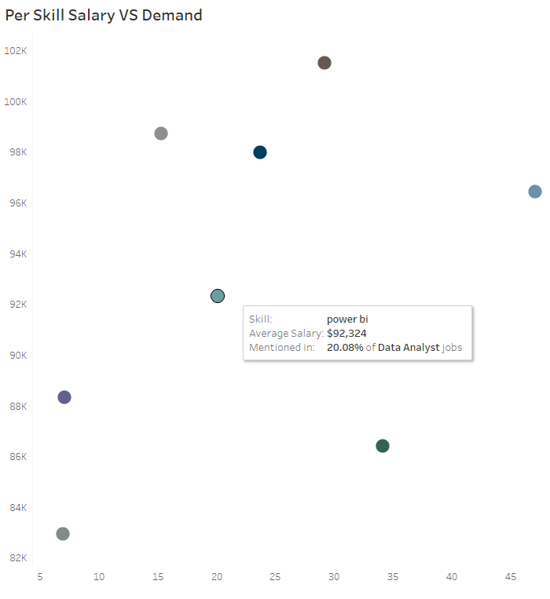

# Introduction

This project explores real-world data on job postings in the data and tech space — breaking down trends in skill demand, salary, education requirements, and remote work availability.

The analysis uses a combination of SQL and Tableau to surface insights for job seekers, hiring managers, and anyone interested in the evolution of technical roles. Whether you're transitioning careers or sharpening your current trajectory, this project is designed to help identify what skills are most valuable — and where the market is headed.

🔗 **Explore the SQL queries:** [Job Market Analysis folder](https://github.com/AengusHafford/Data-Job-Market-Insights/tree/c6fa4dfc24621c53a9639b511fd3f7bdb22a1b09/1%20-SQL_Job_Market_Analysis)  
📊 **View the interactive Tableau dashboard:** [Data Job Market Dashboard](https://public.tableau.com/app/profile/aengus.hafford/viz/DataJobMarketDashboard/JobSkillAnalysisDashboard?publish=yes)        
📂 **Original dataset:** [Google Drive (provided by Luke Barousse)](https://drive.google.com/drive/folders/1moeWYoUtUklJO6NJdWo9OV8zWjRn0rjN) 

# Background

For those transitioning into data and analytics, it can be difficult to know where to focus your time. Which skills are in highest demand? Which roles offer flexibility or career growth? And what tools are truly worth learning?

This project was built to help answer those questions. By analyzing thousands of job postings, I wanted to uncover concrete patterns that could help people — including myself — understand the market more clearly and build their skillset with purpose.

Rather than relying on generic advice like “just learn SQL,” this project aims to show where those skills actually show up in the job market — and how they interact with titles, salaries, and expectations.

# Tools I Used

- **SQL (PostgreSQL):** to clean, transform, and analyze raw job posting data.
- **Tableau Public:** for building visualizations and dashboards.
- **VS Code + GitHub:** for query writing and version control.
- **Excel:** for validating calculations and creating quick summaries.

# The Analysis

### 📌 Skill Demand by Job Title

**Question:**  
What are the most in-demand skills for each job title based on the percentage of job postings mentioning them?

**Purpose:**  
This query calculates the percentage of postings that mention a specific skill for each job title — allowing us to rank the most relevant skills by role. An "All Postings" category is also included to show general trends across the entire dataset.

<br>

🔍 *Want to see the full SQL powering this chart? Click below to expand.*

<details>
<summary>View full SQL and output example</summary>

```sql
CREATE VIEW skill_demand_percent AS
WITH demand_percent AS (
    SELECT
        skill_id,
        COUNT(*) as per_skill_all,
        ROUND((COUNT(*)::numeric / (SELECT COUNT(distinct job_id) FROM skills_job_dim)) * 100, 2) AS perc
    FROM skills_job_dim
    GROUP BY skill_id
),
total_perc AS (
    SELECT
        dp.skill_id,
        skills,
        'All Postings' AS job_title_short,
        per_skill_all,
        perc
    FROM demand_percent dp
    INNER JOIN skills_dim sd ON dp.skill_id = sd.skill_id
),
total_posts_per_title AS (
    SELECT
        job_title_short,
        COUNT(DISTINCT job_id) AS total_postings
    FROM job_postings_fact
    GROUP BY job_title_short
),
per_skill_count AS (
    SELECT
        skjd.skill_id,
        jpf.job_title_short,
        COUNT(*) AS per_skill_total
    FROM skills_job_dim skjd
    INNER JOIN job_postings_fact jpf ON skjd.job_id = jpf.job_id
    GROUP BY skjd.skill_id, jpf.job_title_short
),
title_perc AS (
    SELECT
        psc.skill_id,
        sd.skills,
        psc.job_title_short,
        psc.per_skill_total,
        ROUND((psc.per_skill_total::numeric / tpt.total_postings) * 100, 2) AS perc
    FROM per_skill_count psc
    INNER JOIN total_posts_per_title tpt ON psc.job_title_short = tpt.job_title_short
    INNER JOIN skills_dim sd ON psc.skill_id = sd.skill_id
)
SELECT *, RANK() OVER(PARTITION BY job_title_short ORDER BY perc DESC) AS rnk
FROM title_perc

UNION ALL

SELECT *, RANK() OVER(PARTITION BY job_title_short ORDER BY perc DESC) AS rnk
FROM total_perc
ORDER BY job_title_short, perc DESC;
```

**Output Format (Example):**

| job_title_short | skills | perc  | rnk |
|-----------------|--------|-------|-----|
| Data Analyst    | SQL    | 52.00 | 1   |
| Data Analyst    | Excel  | 43.25 | 2   |
| All Postings    | SQL    | 39.12 | 1   |

</details>


**Filtered to:** `Data Analyst`

*Bar chart visualizing the top 10 skills by percentage of Data Analyst job postings they appear in.*

<br>

💡 **Key Insights:**

- **SQL** is the most in-demand skill across nearly all roles, appearing in **52%** of *Data Analyst* postings and **39.12%** of *All Postings*.
- Skills like **Excel**, **Python**, and **Tableau** are also highly prevalent among Data Analyst roles, with **Excel** specifically ranking second at **43.25%**.
- While **Excel** and **SQL** are foundational, more specialized tools like **Tableau** (32.26%) and **Power BI** (24.48%) highlight the growing emphasis on data visualization.
- Compared to the general job market, Data Analyst roles place significantly more emphasis on tools like **Tableau** (+14.7pp) and **Excel** (+14.6pp). Within the role itself, moving into senior positions further elevates the importance of **SQL**, **Python**, and **Tableau** — signaling that deeper technical fluency is often expected at higher levels.
- These distinctions reflect the technical focus of Data Analyst roles, and can help job seekers prioritize which tools to learn based on their target role.

🔗 *[View this query as a standalone `.sql` file →](https://github.com/AengusHafford/Data-Job-Market-Insights/blob/684fbca5f773f9f8b8972c54c61fa773bdbe47bc/1%20-SQL_Job_Market_Analysis/1_Skill_Demand_View.sql)*
<br>
<br>
### 📌 Skill Demand Over Time


**Question:**  
How has the demand for the top 25 most in-demand skills changed over time by job title?


**Purpose:**  
This query tracks the monthly percentage of job postings that mention each of the top 25 skills, broken out by job title and aggregated across all postings. It helps visualize trends and shifts in skill relevance across roles and over time.

<br>

🔍 *Want to see the full SQL powering this chart? Click below to expand.*

<details>
<summary>View full SQL and output example</summary>

```sql
WITH month_test AS (
    SELECT
        job_id,
        CAST(DATE_TRUNC('month', job_posted_date) AS DATE) AS month_posted
    FROM job_postings_fact
),
filter_posts AS (
    SELECT
        job_title_short, 
        month_posted,
        COUNT(DISTINCT jpf.job_id) as ttl_posts
    FROM job_postings_fact jpf
    JOIN month_test ON jpf.job_id = month_test.job_id
    GROUP BY job_title_short, month_posted
),
filter_skill_count AS (
    SELECT
        skill_id, 
        job_title_short, 
        month_posted,
        COUNT(DISTINCT jpf.job_id) as skill_count
    FROM skills_job_dim sjd
    JOIN job_postings_fact jpf ON sjd.job_id = jpf.job_id
    JOIN month_test ON jpf.job_id = month_test.job_id
    GROUP BY skill_id, job_title_short, month_posted
),
all_posts AS (
    SELECT
        month_posted,
        COUNT(DISTINCT job_id) AS ttl_posts
    FROM month_test
    GROUP BY month_posted
),
all_skill_counts AS (
    SELECT
        sjd.skill_id,
        month_posted,
        COUNT(DISTINCT sjd.job_id) AS skill_count
    FROM skills_job_dim sjd
    JOIN month_test ON sjd.job_id = month_test.job_id
    GROUP BY sjd.skill_id, month_posted
),
per_title_final AS (
    SELECT
        fsc.job_title_short,
        fsc.month_posted, 
        sd.skills,
        ROUND((fsc.skill_count / fp.ttl_posts::numeric) * 100, 2) AS skill_pct
    FROM filter_skill_count fsc
    JOIN filter_posts fp 
        ON fsc.job_title_short = fp.job_title_short 
       AND fsc.month_posted = fp.month_posted
    JOIN skills_dim sd ON fsc.skill_id = sd.skill_id
    WHERE fsc.skill_id IN (
        SELECT skill_id
        FROM skill_demand_percent
        WHERE rnk <= 25
    )
),
all_postings_final AS (
    SELECT
        'All Postings' AS job_title_short,
        apf.month_posted,
        sd.skills,
        ROUND((apf.skill_count / ap.ttl_posts::numeric) * 100, 2) AS skill_pct
    FROM all_skill_counts apf
    JOIN all_posts ap ON apf.month_posted = ap.month_posted
    JOIN skills_dim sd ON apf.skill_id = sd.skill_id
    WHERE apf.skill_id IN (
        SELECT skill_id
        FROM skill_demand_percent
        WHERE rnk <= 25
    )
)
SELECT * FROM per_title_final
UNION ALL
SELECT * FROM all_postings_final
ORDER BY job_title_short, month_posted;
```

**Output Format (Example):**

| job_title_short | month_posted | skills | skill_pct |
|-----------------|---------------|--------|------------|
| Data Analyst    | 2024-06-01    | SQL    | 45.32      |
| Data Analyst    | 2024-06-01    | Excel  | 39.21      |
| All Postings    | 2024-06-01    | Python | 26.04      |

</details>

**Filtered to:** `Data Analyst`

*Line chart showing how demand for top 5 skills has changed month-to-month for Data Analysts.*

<br>

💡 **Key Insights:**

- Between **Dec 2022 and Dec 2023**, **GCP** (+1.48 percentage points), **Power BI** (+1.38pp), and **Scikit-learn** (+1.04pp) showed the strongest growth in demand across *All Postings* — hinting at broader adoption of cloud and ML tools.
- Conversely, demand for **R** dropped significantly (−4.13pp), alongside declines in **Java** (−2.66pp) and **SAS** (−2.21pp), suggesting a shift away from traditional statistical tools in general job postings.
- **SQL** remained the most in-demand skill across all months, and even saw a modest increase in share (+0.93pp), reinforcing its long-term importance.
- Despite its dominance, **SQL** — along with **Python** and **R** — showed notable **month-to-month fluctuations**, suggesting these core skills may be influenced by project cycles or hiring seasonality rather than long-term decline.
- In contrast, niche or legacy skills like **VMware**, **Powershell**, and **TypeScript** had extremely steady demand throughout the year, despite relatively low overall presence.


🔗 *[View this query as a standalone `.sql` file →](https://github.com/AengusHafford/Data-Job-Market-Insights/blob/684fbca5f773f9f8b8972c54c61fa773bdbe47bc/1%20-SQL_Job_Market_Analysis/2_Skill_Demand_Over_Time.sql)*
<br>
<br>
### 📌 Average Salary by Skill

**Question:**  
Which of the top 25 most in-demand skills are associated with the highest average salaries by job title?

**Purpose:**  
This query joins salary data with skill demand to calculate the average salary for each of the top 25 skills per job title. An "All Postings" category is also included to show general trends in skill-value alignment across the entire job market.

<br>

🔍 *Want to see the full SQL powering this chart? Click below to expand.*

<details>
<summary>View full SQL and output example</summary>

```sql
WITH top_skills_salary AS (
    SELECT 
        sdp.job_title_short,
        sd.skills,
        ROUND(AVG(jpf.salary_year_avg), 0) AS avg_salary
    FROM job_postings_fact jpf
    INNER JOIN skills_job_dim sjd ON jpf.job_id = sjd.job_id
    INNER JOIN skills_dim sd ON sjd.skill_id = sd.skill_id
    INNER JOIN skill_demand_percent sdp
        ON sjd.skill_id = sdp.skill_id
        AND jpf.job_title_short = sdp.job_title_short
    WHERE 
        jpf.salary_year_avg IS NOT NULL
        AND sdp.rnk <= 25
    GROUP BY 
        sdp.job_title_short, sd.skills
),
all_postings_salary AS (
    SELECT
        'All Postings' AS job_title_short,
        sd.skills,
        ROUND(AVG(jpf.salary_year_avg), 0) AS avg_salary
    FROM job_postings_fact jpf
    INNER JOIN skills_job_dim sjd ON jpf.job_id = sjd.job_id
    INNER JOIN skills_dim sd ON sjd.skill_id = sd.skill_id
    WHERE sd.skills IN (
        SELECT skills
        FROM skill_demand_percent
        WHERE job_title_short = 'All Postings' AND rnk <= 25
    )
    GROUP BY sd.skills
)
SELECT * FROM top_skills_salary
UNION ALL
SELECT * FROM all_postings_salary
ORDER BY job_title_short, avg_salary DESC;
```

**Output Format (Example):**

| job_title_short | skills   | avg_salary |
|-----------------|----------|------------|
| Data Engineer   | Spark    | 153000     |
| Data Engineer   | Kafka    | 149000     |
| All Postings    | Python   | 132000     |

</details>

**Filtered to:** `Data Analyst`

*Bar chart showing average salary associated with each in-demand skill for Data Analysts.*

<br>

💡 **Key Insights:**

- Across *All Postings*, the highest-paying skills are clustered around backend and infrastructure tools — including **Scala** ($145K), **Kafka** ($145K), **Airflow**, and **Spark** — all above $140K.
- For *Data Engineers*, tools like **Spark**, **Snowflake**, and **Kafka** dominate the salary leaderboard — all above $147K — reinforcing the strong salary ceiling tied to cloud and big data platforms.
- *Data Scientists* show a more ML-oriented salary profile, with **Scala**, **PyTorch**, and **Kubernetes** at the top — suggesting that low-level programming and model deployment experience are especially valuable.
- *Data Analysts* still command strong pay for skills like **Jira**, **Snowflake**, and **Go**, but their top salaries trend slightly lower than those for more engineering-heavy roles.

🔗 *[View this query as a standalone `.sql` file →](https://github.com/AengusHafford/Data-Job-Market-Insights/blob/684fbca5f773f9f8b8972c54c61fa773bdbe47bc/1%20-SQL_Job_Market_Analysis/3_Avg_Salary_Per_Skill.sql)*
<br>
<br>
### 📌 Remote and Degree Requirement Percentages

**Question:**  
What percentage of job postings are remote, and what percentage mention a degree requirement — by job title and overall?

**Purpose:**  
This query calculates two separate percentages for each job title (and overall):  
1. The share of postings that are remote vs. non-remote  
2. The share of postings that mention a degree requirement vs. those that do not  

These breakdowns help illustrate how flexible different job roles are in terms of location and education expectations.

<br>

🔍 *Want to see the full SQL powering this chart? Click below to expand.*

<details>
<summary>View full SQL and output example</summary>

```sql
WITH counts AS (
    SELECT
        job_title_short,
        COUNT(CASE WHEN job_work_from_home = TRUE THEN 1 END) AS remote_count,
        COUNT(CASE WHEN job_work_from_home = FALSE THEN 1 END) AS non_remote_count,
        COUNT(CASE WHEN job_no_degree_mention = TRUE THEN 1 END) AS no_degree_count,
        COUNT(CASE WHEN job_no_degree_mention = FALSE THEN 1 END) AS degree_count,
        COUNT(*) AS ttl_count
    FROM job_postings_fact
    GROUP BY job_title_short
),
all_postings AS (
    SELECT
        'All Postings' AS job_title_short,
        SUM(remote_count) AS remote_count,
        SUM(non_remote_count) AS non_remote_count,
        SUM(no_degree_count) AS no_degree_count,
        SUM(degree_count) AS degree_count,
        SUM(ttl_count) AS ttl_count
    FROM counts
),
combined_counts AS (
    SELECT * FROM counts
    UNION ALL
    SELECT * FROM all_postings
),
long_format AS (
    SELECT 
        job_title_short,
        'Remote' AS category,
        remote_count AS count,
        ROUND(remote_count::numeric / ttl_count * 100, 2) AS pct
    FROM combined_counts

    UNION ALL

    SELECT 
        job_title_short,
        'Non-Remote',
        non_remote_count,
        ROUND(non_remote_count::numeric / ttl_count * 100, 2)
    FROM combined_counts

    UNION ALL

    SELECT 
        job_title_short,
        'Degree Required',
        degree_count,
        ROUND(degree_count::numeric / ttl_count * 100, 2)
    FROM combined_counts

    UNION ALL

    SELECT 
        job_title_short,
        'No Degree Required',
        no_degree_count,
        ROUND(no_degree_count::numeric / ttl_count * 100, 2)
    FROM combined_counts
)
SELECT *
FROM long_format
ORDER BY job_title_short, category;
```

**Output Format (Example):**

| job_title_short | category            | count | pct   |
|------------------|----------------------|--------|--------|
| Data Analyst     | Remote               | 742    | 41.23 |
| Data Analyst     | Non-Remote           | 1062   | 58.77 |
| Data Analyst     | Degree Required      | 1422   | 78.77 |
| Data Analyst     | No Degree Required   | 382    | 21.23 |
| All Postings     | Remote               | 3412   | 36.45 |
| All Postings     | Non-Remote           | 5942   | 63.55 |
| All Postings     | Degree Required      | 7001   | 74.73 |
| All Postings     | No Degree Required   | 2371   | 25.27 |
</details>

**Filtered to:** `Data Analyst`
 <br>
*Bar chart showing percentage of postings that mention degree requirements vs. those that do not — for Data Analysts.*
<br>
<br>
<br>
 <br>
*Bar chart showing the share of remote vs. non-remote postings - for Data Analysts.*

<br>

💡 **Key Insights:**

- While **91%** of all job postings are non-remote, roles like **Senior Data Engineer** (14.7% remote) and **Data Engineer** (11.4%) offer slightly higher flexibility — making them stand out in a largely in-office job market.
- **Software Engineers** top the chart in education flexibility, with nearly **48.2%** of postings not mentioning a degree requirement. **Cloud Engineers** and **Data Engineers** follow closely at around 43–48%.
- *Data Analysts*, while not leading in either category, still show notable accessibility: **38.7%** of roles lack a degree requirement, and **7.9%** are remote.
- On the other end of the spectrum, roles like **Senior Data Scientist**, **Data Scientist**, and **Machine Learning Engineer** are among the most strict — with **over 92%** of listings mentioning a degree requirement.
- 📈 **Seniority does make a difference**:  
  Senior roles offer **slightly more remote flexibility** (11.0% vs. 7.8%) but tend to be **stricter on degree requirements** (28.5% vs. 31.0%).

🔗 *[View this query as a standalone `.sql` file →](https://github.com/AengusHafford/Data-Job-Market-Insights/blob/684fbca5f773f9f8b8972c54c61fa773bdbe47bc/1%20-SQL_Job_Market_Analysis/4_Remote_and_degree_Pct.sql)*
<br>
<br>
### 📌 Average and Median Salary by Job Title

**Question:**  
What is the average and median salary for each job title, and how does it compare to the overall average across all postings?

**Purpose:**  
This query calculates both the average and median salary for each job title in the dataset, including a benchmark value across all postings. It enables quick comparison of compensation levels by role.

<br>

🔍 *Want to see the full SQL powering this chart? Click below to expand.*

<details>
<summary>View full SQL and output example</summary>

```sql
SELECT
    job_title_short,
    ROUND(AVG(salary_year_avg), 0) AS avg_salary,
    percentile_cont(0.5) WITHIN GROUP (ORDER BY salary_year_avg)::numeric(10, 0) AS median_salary
FROM job_postings_fact
WHERE salary_year_avg IS NOT NULL
GROUP BY job_title_short

UNION ALL

SELECT
    'All Postings' AS job_title_short,
    ROUND(AVG(salary_year_avg), 0) AS avg_salary,
    percentile_cont(0.5) WITHIN GROUP (ORDER BY salary_year_avg)::numeric(10, 0) AS median_salary
FROM job_postings_fact
WHERE salary_year_avg IS NOT NULL
ORDER BY avg_salary DESC;
```

**Output Format (Example):**

| job_title_short | avg_salary | median_salary |
|-----------------|------------|----------------|
| Data Engineer   | 130267     | 128000         |
| Data Analyst    | 102856     | 100000         |
| All Postings    | 110401     | 106000         |

</details>

 <br>
*Bar chart showing the Average and Median salary per title.* <br>

<br>

💡 **Key Insights:**

- **Senior Data Scientist** is the top-paying title, with an average salary of **$154K**, slightly exceeding its median — suggesting consistent high compensation across postings.
- Other high-paying roles include **Senior Data Engineer** ($146K) and **Data Scientist** ($136K), reinforcing the premium on advanced technical and modeling roles.
- Titles like **Machine Learning Engineer** and **Cloud Engineer** show significant gaps between average and median salary (over $20K), indicating skewed distributions — likely driven by a subset of high-paying positions.
- *Data Analyst* sits closer to the middle of the pack, with a median of **$100K** and an average of **$102.9K**, suggesting relatively balanced salary expectations compared to more variable roles like *Software Engineer* or *ML Engineer*.

🔗 *[View this query as a standalone `.sql` file →](https://github.com/AengusHafford/Data-Job-Market-Insights/blob/main/1%20-SQL_Job_Market_Analysis/5_Avg_Salary_Per_Title_KPI.sql)*
<br>
<br>
### 📌 Per-Skill Salary vs. Demand (Bonus Insight)

**Question:**  
Which skills offer the strongest balance between salary and demand?

**Purpose:**  
This scatterplot overlays the average salary for each skill against how frequently it's mentioned in job postings. It helps identify high-paying skills that are also in demand — useful for both career targeting and hiring insights.

**Note:**  
This visualization blends outputs from the following queries:  
- 📌 *[Skill Demand by Job Title](#📌-skill-demand-by-job-title)*  
- 📌 *[Average Salary by Skill](#📌-average-salary-by-skill)*  
It was created directly in Tableau and does not use a standalone SQL file.

**Filtered to:** `Data Analyst` <br>
 <br>
*Scatter plot mapping average salary against percentage of Data Analyst job postings each skill appears in.*

<br>

💡 **Key Insights:**

- **Python** is uniquely positioned as both one of the **highest paying** and **most in-demand** skills across nearly all senior technical roles — especially *Senior Data Scientist*, *Senior Data Engineer*, and *Machine Learning Engineer*. It consistently ranks **top 5 in both salary and mention frequency**.
- **SQL** remains a universally critical skill, particularly among analysts and engineers. While it offers slightly lower average salaries than cutting-edge tools, its **extremely high demand** (often above **60%** of postings) cements it as an **essential foundational skill** for career entry and progression.
- **Spark**, **Scala**, and **Kafka** deliver **exceptionally strong salaries** (often **$150K+**) and appear frequently in *Senior Data Engineer* and *ML Engineer* roles. Though not as widely required as SQL or Python, their presence in **high-paying backend and infrastructure roles** makes them valuable upskilling targets.
- Several senior-level *Data Scientist* postings emphasize tools like **Pytorch**, **TensorFlow**, and **Scikit-learn** — skills that, while less frequently mentioned, are often tied to the **highest average salaries in the dataset** (**$155K+**). These tools represent **high-leverage specialization paths** for those pursuing advanced ML roles.
- **AWS** and **Azure** consistently appear in the **middle of the salary-demand balance**, offering **broad utility** across roles (*engineers, analysts, and scientists* alike). They serve as **strong complements to core programming and data skills**, especially for platform engineering and scalable analytics work.

# What I learned

This project helped reinforce how much value strong fundamentals bring to a data role. Tools like SQL and Excel may not be flashy, but their presence across nearly every job title and salary tier drove home just how essential they are — not only for getting hired, but for understanding how data actually works in the real world.

Working with real-world data also highlighted how messy, uneven, and unpredictable job postings can be. I had to think critically about how to define demand, normalize job titles, and deal with partial or missing salary data. These challenges were frustrating at times, but they also felt representative of actual problems you’d encounter on the job.

It was also a great opportunity to level up my ability to think in terms of queries — not just for one-off answers, but for reusable views, KPIs, and metrics that could support a variety of visualizations.

Lastly, building the Tableau dashboard pushed me to think more visually. Instead of just focusing on code, I had to consider what would make sense to a hiring manager or a fellow job seeker — and how to communicate something clearly in just a few clicks or glances.

# Conclusions

The key takeaway from this project is that hiring trends aren't random — they reflect very real priorities in the workforce. If a skill consistently shows up in high-paying roles, or if it’s climbing in monthly demand, that’s a signal worth paying attention to.

For career changers or early-stage professionals, this kind of analysis can help make learning more strategic. Instead of trying to “learn everything,” we can focus on the skills that show up in the jobs we actually want.

At the same time, the data shows that no single skill is a silver bullet. Strong candidates often combine high-demand technical tools (like SQL and Python) with supporting strengths — whether that’s communication, cloud platforms, or data visualization.

Ultimately, this project wasn’t just an exercise in querying or charting. It was a chance to better understand the space I’m moving into — and to help others do the same.
